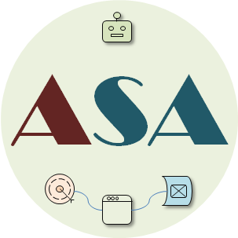

# ASA (AI Solution Architecture) Model Specification

## Synopsis

Many organizations have moved beyond simple querying and exploration. The real issue is **enterprise-wide adoption and absorption of AI**. As AI solutions scale across the enterprise, they require a clear architectural model to guide direction, redesign, and long-term sustainability.

The ASA model specification is designed to support enterprise-grade AI solution architecture, including AI-native, integrative, and hybrid solutions. 

## Details

 *ASA* Modeling Approach

For the detailed specification, see this [link](docs/ai-esa-specification.md).

---

## Timeline

- 2026-05-23 Initial public documentation
