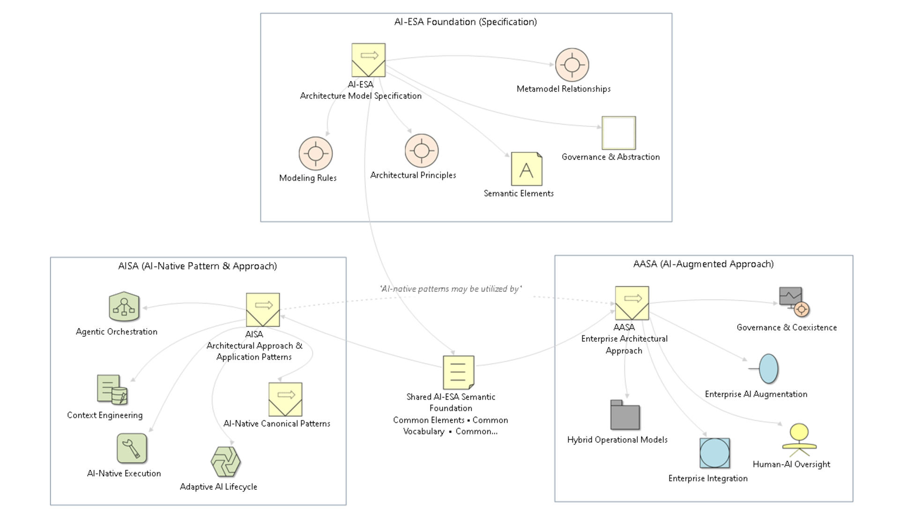

# Relationship of the AI-ESA Model Specification to AISA and AASA

This section briefly describes the relationship among AI-ESA (AI Enterprise Solution Architecture Model Specification), AISA (AI Solution Architecture Approach & Pattern), and AASA (AI-Augmented Solution Architecture Approach). Figure 1 shows the overall relationship.

*Figure 1: Relationship among AI-ESA, AISA and AASA*

## AI-ESA’s Emphasis on AISA and AASA

The AI-ESA elements are used in both AISA and AASA, but they differ in terms of primary emphasis, architectural centrality, and operational dominance. Table 1 illustrates how elements are prioritized across AISA and AASA, categorized as primary, secondary, or shared/foundation elements.

| **Element**          | **AISA Emphasis** | **AASA Emphasis** | **Notes**                                        |
| -------------------- | ----------------- | ----------------- | ------------------------------------------------ |
| Intent               | Secondary         | **Primary**       | Enterprise alignment stronger in AASA            |
| Capability           | Shared            | **Primary**       | Enterprise capability mapping emphasized in AASA |
| Requirement          | Shared            | Shared            | Core architectural concern                       |
| Governance           | Secondary         | **Primary**       | AASA governance-centric                          |
| Decision             | Shared            | **Primary**       | Enterprise trade-offs emphasized in AASA         |
| Access Interface     | Shared            | Shared            | Human interaction remains essential              |
| Application          | Shared            | **Primary**       | Still important in AI-native systems             |
| App Logic            | Shared            | **Primary**       | Deterministic orchestration remains necessary    |
| Data Service         | Shared            | **Primary**       | Enterprise integration and data continuity       |
| Technical Component  | Shared            | **Primary**       | Enterprise operational infrastructure            |
| AI Agent             | **Primary**       | Shared            | Core architectural primitive in AISA             |
| AI Coordinator       | **Primary**       | Shared            | Agent orchestration emphasis in AISA             |
| Context State        | **Primary**       | Shared            | Critical for AI interaction continuity           |
| AI Model             | **Primary**       | Shared            | Core AI runtime capability                       |
| Knowledge Service    | **Primary**       | Shared            | RAG/context grounding emphasis                   |
| AI/ML Lifecycle      | **Primary**       | Secondary         | AI operational lifecycle focus                   |
| Autonomous Tool      | **Primary**       | Secondary         | Tool invocation more central in AISA             |
| Data Store           | Shared            | Shared            | Foundational                                     |
| Deployment Package   | Shared            | Shared            | Runtime operationalization                       |
| Node                 | Shared            | Shared            | Infrastructure/runtime                           |
| Quality & Adaptation | **Primary**       | Shared            | Continuous learning emphasis in AISA             |
| Governance Control   | Shared            | **Primary**       | Operational governance emphasis in AASA          |
| Interface Contract   | Shared            | **Primary**       | Enterprise interoperability                      |
| Middleware           | Secondary         | **Primary**       | Enterprise integration layer                     |
| Group                | Shared            | Shared            | Structural organization                          |
| Role                 | Secondary         | **Primary**       | Organizational alignment emphasis                |
| Task                 | Secondary         | **Primary**       | Operational/business workflow emphasis           |
| Input                | **Primary**       | Shared            | AI interaction/input-centric                     |
| Output               | **Primary**       | Shared            | AI-generated output emphasis                     |
| Note                 | Shared            | Shared            | Documentation/support                            |

*Table 1: AI-ESA's emphasis on AISA and AASA*

Note that AI-native does NOT mean "pure agents," or "everything autonomous."

Real enterprise AI solutions still need:

- Orchestration and deterministic logic,

- Integration and transactional consistency,

- Observability and operational control.

Both AISA and AASA approaches use the AI-ESA element specification for modeling. AISA focuses on AI-native and AI-primitive patterns, whereas AASA emphasizes AI-augmented solution architecture.

### Shared Core

Both AISA and AASA use the AI-ESA element specification and share a common semantic architectural foundation:

- AI-ESA semantics

- element taxonomy

- abstraction rules

- metamodel

- architectural significance

### Key Differences

Table 2 summarizes the key differences between AISA (AI Solution Architecture) and AASA (AI-Augmented Solution Architecture) in their respective AI adoption strategies.

| **Aspect**                     | **AISA (AI Solution Architecture)**                                    | **AASA (AI-Augmented Solution Architecture)**                                                   |
| ------------------------------ | ---------------------------------------------------------------------- | ----------------------------------------------------------------------------------------------- |
| Primary Orientation            | AI-native execution orientation                                        | Enterprise coexistence orientation                                                              |
| Core Philosophy                | AI-first operationalization                                            | Gradual AI absorption and coexistence                                                           |
| Architectural Focus            | AI-native architectural operationalization                             | Enterprise augmentation and governance adaptation                                               |
| AI Treatment                   | AI-specific elements are treated as first-class architectural elements | AI capabilities are integrated into existing enterprise environments                            |
| Operational Strategy           | Autonomous and agentic-oriented                                        | Hybrid, governed, and coexistence-oriented                                                      |
| Enterprise Strategy            | Designed around AI-native solution patterns                            | Designed around enterprise integration and continuity                                           |
| Governance Emphasis            | Validation, adaptation, and learning loops                             | Governance control, integration assurance, and operational sustainability                       |
| Relationship to AI Engineering | Much closer association with AI system engineering                     | More aligned with enterprise business and operational architecture                              |
| Relationship Between Them      | Defines AI-native patterns and operational approaches                  | Likely utilizes AISA patterns within enterprise environments                                    |
| Typical Environment            | AI-centric or AI-driven solution ecosystems                            | Heterogeneous enterprise ecosystems with mixed technologies                                     |
| Audience                       | AI architects, AI engineers, solution architects, AI platform teams    | Enterprise architects, enterprise solution architects, governance teams, transformation leaders |
| Architectural Style            | AI-native and orchestration-centric                                    | Augmented, integrated, hybrid, and coexistence-centric                                          |

*Table 2: Key differences between AISA and AASA*

Or, more simply, their differences can be expressed as follows:

**AISA**

- AI-native operational emphasis

- orchestration-centric

- adaptive systems

- agent-first abstraction

**AASA**

- enterprise coexistence

- governance-heavy

- integration-centric

- operational continuity

In summary, AI-ESA serves as the foundational specification and semantic abstraction. AISA represents an AI-native architectural operationalization approach. AASA, in contrast, is an enterprise architecture focused on AI coexistence and augmentation.
