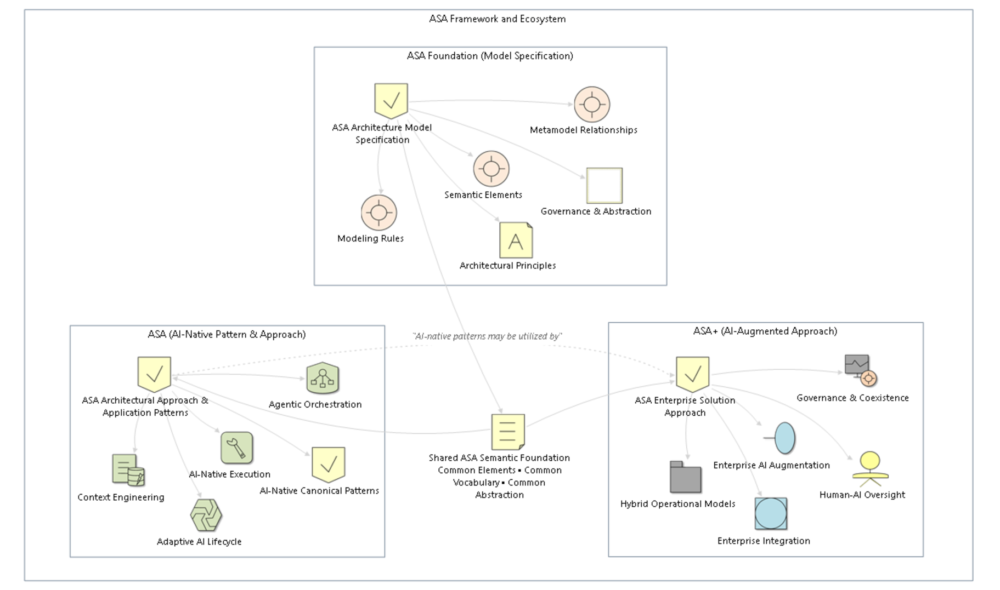

# Relationship of the ASA Model Specification to ASA and ASA+ Apporaches

This section briefly describes the relationship among ASA (AI Solution Architecture) model specification, ASA (AI Solution Architecture Approach & Pattern), and AIS+ (AI-Augmented Solution Architecture Approach). Figure 1 shows the overall relationship.

*Figure 1: Relationship among ASA model, ASA (ecosystem & AI-native approach) and ASA+*

## ASA Model’s Emphasis on ASA and ASA+

The ASA elements are used in both ASA and ASA+ approaches, but they differ in terms of primary emphasis, architectural centrality, and operational dominance. Table 1 illustrates how elements are prioritized across ASA and AIS+, categorized as primary, secondary, or shared/foundation elements.

| **Element**          | **ASA Emphasis** | ASA+ Emphasis | **Notes**                                                     |
| -------------------- | ---------------- | ------------- | ------------------------------------------------------------- |
| Intent               | Secondary        | **Primary**   | Enterprise alignment stronger in AI-augmented arch            |
| Capability           | Shared           | **Primary**   | Enterprise capability mapping emphasized in AI-augmented arch |
| Requirement          | Shared           | Shared        | Core architectural concern                                    |
| Governance           | Secondary        | **Primary**   | AI-augmented arch governance-centric                          |
| Decision             | Shared           | **Primary**   | Enterprise trade-offs emphasized in AI-augmented arch         |
| Access Interface     | Shared           | Shared        | Human interaction remains essential                           |
| Application          | Shared           | **Primary**   | Still important in AI-native systems                          |
| App Logic            | Shared           | **Primary**   | Deterministic orchestration remains necessary                 |
| Data Service         | Shared           | **Primary**   | Enterprise integration and data continuity                    |
| Technical Component  | Shared           | **Primary**   | Enterprise operational infrastructure                         |
| AI Agent             | **Primary**      | Shared        | Core architectural primitive in AI-native arch                |
| AI Coordinator       | **Primary**      | Shared        | Agent orchestration emphasis in AI-native arch                |
| Context State        | **Primary**      | Shared        | Critical for AI interaction continuity                        |
| AI Model             | **Primary**      | Shared        | Core AI runtime capability                                    |
| Knowledge Service    | **Primary**      | Shared        | RAG/context grounding emphasis                                |
| AI/ML Lifecycle      | **Primary**      | Secondary     | AI operational lifecycle focus                                |
| Autonomous Tool      | **Primary**      | Secondary     | Tool invocation more central in AI-native arch                |
| Data Store           | Shared           | Shared        | Foundational                                                  |
| Deployment Package   | Shared           | Shared        | Runtime operationalization                                    |
| Node                 | Shared           | Shared        | Infrastructure/runtime                                        |
| Quality & Adaptation | **Primary**      | Shared        | Continuous learning emphasis in AI-native arch                |
| Governance Control   | Shared           | **Primary**   | Operational governance emphasis in AI-augmented arch          |
| Interface Contract   | Shared           | **Primary**   | Enterprise interoperability                                   |
| Middleware           | Secondary        | **Primary**   | Enterprise integration layer                                  |
| Group                | Shared           | Shared        | Structural organization                                       |
| Role                 | Secondary        | **Primary**   | Organizational alignment emphasis                             |
| Task                 | Secondary        | **Primary**   | Operational/business workflow emphasis                        |
| Input                | **Primary**      | Shared        | AI interaction/input-centric                                  |
| Output               | **Primary**      | Shared        | AI-generated output emphasis                                  |
| Note                 | Shared           | Shared        | Documentation/support                                         |

*Table 1: Model's emphasis on AI-native arch and AI-augmented arch*

Note that AI-native does NOT mean "pure agents," or "everything autonomous."

Real enterprise AI solutions still need:

- Orchestration and deterministic logic,

- Integration and transactional consistency,

- Observability and operational control.

Both ASA and ASA+ approaches use the ASA element specification for modeling. ASA focuses on AI-native and AI-primitive patterns, whereas AIS+ emphasizes AI-augmented solution architecture.

### Shared Core

Both ASA and ASA+ approaches use the ASA element specification and share a common semantic architectural foundation:

- ASA semantics

- element taxonomy

- abstraction rules

- metamodel

- architectural significance

### Key Differences

Table 2 summarizes the key differences between ASA (AI-Native Solution Architecture) and AIS+ (AI-Augmented Solution Architecture) in their respective AI adoption strategies.

| **Aspect**                     | **ASA(AI Solution Architecture)**                                      | **ASA+ (AI-Augmented Solution Architecture)**                                                   |
| ------------------------------ | ---------------------------------------------------------------------- | ----------------------------------------------------------------------------------------------- |
| Primary Orientation            | AI-native execution orientation                                        | Enterprise coexistence orientation                                                              |
| Core Philosophy                | AI-first operationalization                                            | Gradual AI absorption and coexistence                                                           |
| Architectural Focus            | AI-native architectural operationalization                             | Enterprise augmentation and governance adaptation                                               |
| AI Treatment                   | AI-specific elements are treated as first-class architectural elements | AI capabilities are integrated into existing enterprise environments                            |
| Operational Strategy           | Autonomous and agentic-oriented                                        | Hybrid, governed, and coexistence-oriented                                                      |
| Enterprise Strategy            | Designed around AI-native solution patterns                            | Designed around enterprise integration and continuity                                           |
| Governance Emphasis            | Validation, adaptation, and learning loops                             | Governance control, integration assurance, and operational sustainability                       |
| Relationship to AI Engineering | Much closer association with AI system engineering                     | More aligned with enterprise business and operational architecture                              |
| Relationship Between Them      | Defines AI-native patterns and operational approaches                  | Likely utilizes AI-natvie patterns within enterprise environments                               |
| Typical Environment            | AI-centric or AI-driven solution ecosystems                            | Heterogeneous enterprise ecosystems with mixed technologies                                     |
| Audience                       | AI architects, AI engineers, solution architects, AI platform teams    | Enterprise architects, enterprise solution architects, governance teams, transformation leaders |
| Architectural Style            | AI-native and orchestration-centric                                    | Augmented, integrated, hybrid, and coexistence-centric                                          |

*Table 2: Key differences between ASA and ASA+*

Or, more simply, their differences can be expressed as follows:

**ASA**

- AI-native operational emphasis

- orchestration-centric

- adaptive systems

- agent-first abstraction

**AIS+**

- enterprise coexistence

- governance-heavy

- integration-centric

- operational continuity

In summary, ASA model serves as the foundational specification and semantic abstraction. ASA represents an AI-native architectural operationalization approach. AIS+, in contrast, is an enterprise architecture focused on AI coexistence and augmentation.

## About ASA Naming

ASA (AI Solution Architecture) is a generic architectural language and framework family used to describe the ASA ecosystem, its foundational model, and its architectural approaches.

Within this context:

- **ASA** = the umbrella framework and ecosystem

- **ASA Model** = the foundational specification and reference model

- **ASA Approach** = the AI-native architectural domain, approach, and practice

- **AIS+** = the adaptive, integrative, and AI-augmented architectural extension approach

For terminology alignment and continuity, AIS-related concepts may also be referred to as:

- **AI-ESA** (AI Enterprise Solution Architecture), referring to the ASA model or framework foundation

- **AISA** (AI Solution Architecture), referring to ASA approach

- **AASA** (AI-Augmented Solution Architecture), referring to AIS+ approach

In general usage, **ASA** represents the overall architectural language, framework family, and associated architectural landing approaches.

## FAQ (Frequently Asked Questions)

### ASA vs. AI System Architecture

System architecture is primarily a technical architecture, whereas ASA incorporates intent and metrics, introducing a higher level of abstraction to capture key architectural concerns end-to-end. In short:

- AI system architecture = technical system composition

- ASA = enterprise solution architecture abstraction for AI ecosystems

### ESA vs. SA (Solution Architecture)

For simplicity, ESA (Enterprise Solution Architecture) is often abbreviated as SA (Solution Architecture). In ASA, the term refers to SA (Solution Architecture) but typically refers to ESA (Enterprise Solution Architecture), since ASA is primarily applied to enterprise solutions. Whether a solution is considered enterprise-grade depends on its scale, complexity, and organizational impact.

In this document, ASA may also be referred to as AIA (AI Architecture) when it effectively represents a solution architecture context.
